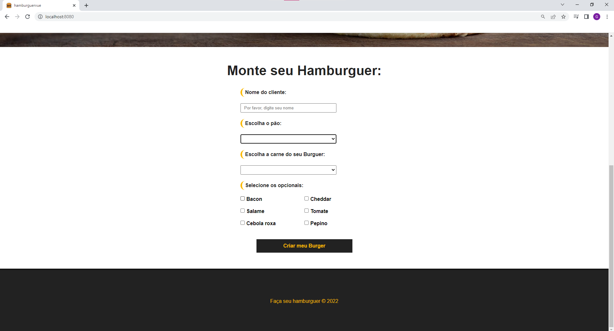
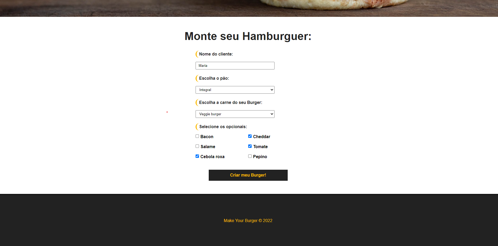
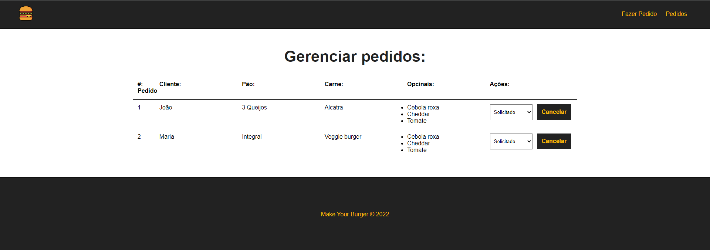

# Hamburger Vue 🍔

Projeto de pedidos de hamburger feito com Vue, Vue-router e Javascript

## Home da página:

## Formulário para criação de pedidos:

## Pedido sendo feito

# Pedido registrado no Dashboard

